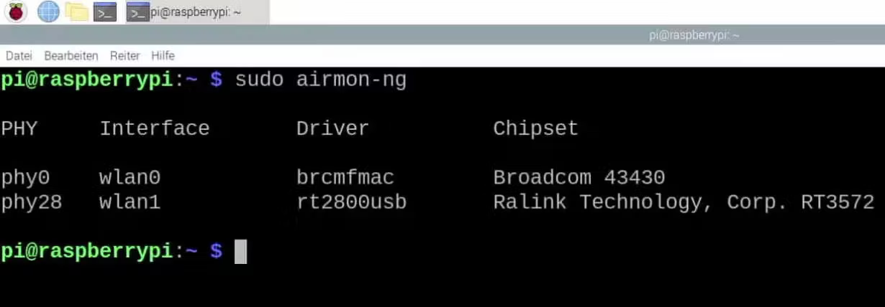
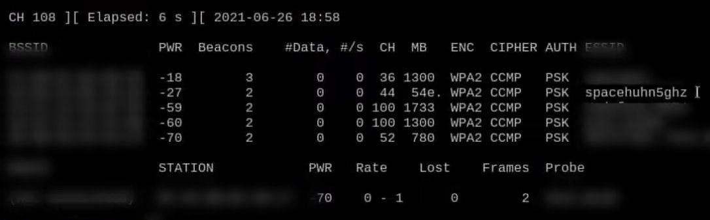

# 5Ghz Deauther using mdk4 and aircrack-ng

- I would love to provide you with an easy-to-use 5 GHz WiFi research tool, but unfortunately, I haven't yet been able to find a suitable microcontroller that would allow for 5 GHz WiFi hacking. But we do highly anticipate the upcoming ESP32-C5 from Espressif.

What you need: 
- A computer running Linux (you can use your computer or a Raspberry Pi)
A Dual-Band WiFi adapter that supports packet injection (to send custom packets) and monitor mode (to sniff raw network traffic)
We need a Linux machine because the drivers and tools we will use aren't available for other operating systems. But running Linux is the easy part. Finding a supported WiFi adapter, however, is tricky.

Some built-in network cards will work for WiFi hacking, but you never know for sure until you try them out. I recommend getting a <b>rtl8812au</b> based card, like the <b>AWUS036AC</b> or <b>AWUS036ACH</b> from ALFA. Alternatively, you can also use a Raspberry Pi with [nexmon](https://github.com/seemoo-lab/nexmon)

# Amazon links

rtl8812AU cards: [AliExpress](https://s.click.aliexpress.com/e/_9iKln5), [Amazon](https://amzn.to/3u2xWRU)
ALFA AWUS036AC: [Amazon](https://amzn.to/3u62Ngo)
ALFA AWUS036ACH: [Amazon](https://amzn.to/3DG3mko)

# Installing rtl8812au Driver

sudo apt install dkms
git clone https://github.com/aircrack-ng/rtl8812au.git
cd rtl8812au
sudo make dkms_install

# Installing mdk4 and aircrack-ng

- MDK4 is a "proof-of-concept tool to exploit common IEEE 802.11 protocol weaknesses". It supports 5 GHz and a variety of attacks and is easy to use. To install run:

 <b>sudo apt install mdk4</b> 
 
- But we will also need Aircrack-ng, which is "a complete suite of tools to assess WiFi network security". To install it, run:
 
 <b>sudo apt install aircrack-ng</b>
 
 # Enable monitor mode
- To see all WiFi packets in the air around you, not just those addressed to your device, you must put the WiFi card into monitor mode.
First, check the name of the available WiFi interfaces by running:

<b>sudo airmon-ng</b>

As a result, you should see something like this:

- wlan0 is our built-in WiFi
- wlan1 is the external ALFA WiFi card

Since we want to use the ALFA card, running the following commands will enable monitor mode on wlan1:

<b>sudo ifconfig wlan1 down</b>
  
<b>sudo iwconfig wlan1 mode monitor</b>
  
<b>sudo ifconfig wlan1 up</b>

# Finding the target network

- Now with monitor mode enabled, we can scan for the available WiFi networks and determine which is ours. Do never run these attacks on other people's networks without permission!

Airodump-ng is an excellent WiFi scanner that is part of the Aircrack-ng suite. Because we're looking to test a 5 GHz network specifically, we additionally need to supply the "band" argument:

<b>sudo airodump-ng wlan1 --band a</b>

Once you find the network you're looking for, press CTRL+C to stop airodump-ng. Here our test network is called "spacehuhn5ghz" and it's a WPA2-protected network operating on channel 44. [Spacehuhn Blog](https://blog.spacehuhn.com/5ghz-deauther)

# Deauthing using mdk4

- To start deauthing your test network run: in "YOURWIFIAP" you need to put the AP/Name of your wifi.

<b>sudo mdk4 wlan1 d -E YOURWIFIAP</b>

- Now try to connect to the test network. If you struggle to establish a connection, the attack is working, and your network is vulnerable to this kind of attack. 🎉

If your network connection is not disrupted, then it might be immune to deauthentication attacks. You can read more about that in [Spacehuhn Blog](https://blog.spacehuhn.com/deauth-attack-not-working/) post Why the Deauthentication Attack isn't working

# Thanks to [Spacehuhn for explained tutorial](https://github.com/SpacehuhnTech/)

- B4CKDOOR

