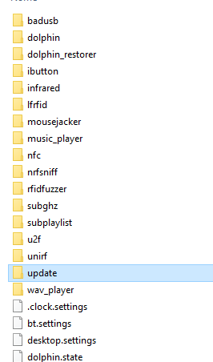
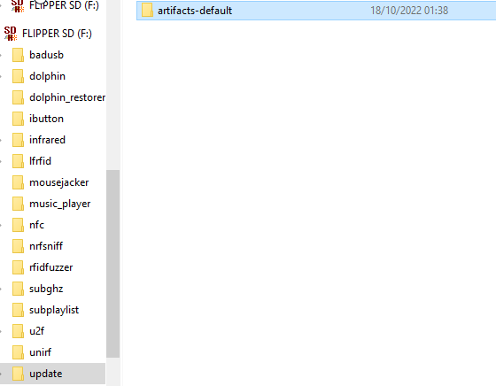

# How to update the firmware of the Flipper Zero custom, Rogue / Unleashed (SUPER EASY)

- This installation via <b>SD-card</b> from a computer is the simplest and most functional way to update your custom firmware to a new firmware update, or you simply have the RogueMaster firmware and want to try the Unleashed firmware or vice versa just follow these small steps to do all correctly without having to bang your head with the .dfu file or anything else.

- First we download the update file from the [RogueMaster](https://github.com/RogueMaster/flipperzero-firmware-wPlugins/releases) or [Unleashed](https://github.com/DarkFlippers/unleashed-firmware/releases) repository. Just download the last .zip or .tgz folder. (And yes, even if you want to switch for example from RogueMaster to Unleashed, you will always have to do this step, whether it is a firmware update or change.)

- Once you have downloaded the .zip or .tgz folder, extract it to the Desktop, so that you will have the unzipped folder in the Desktop.
- Insert the <b>SD-card</b> of your <b>FlipperZero</b> into the computer (Only the <b>SD-card</b>, the flipper can also be switched off, we only want the SD-Card to be connected to the computer with its adapter) and open the file manager of the <b>SD-card</b> and first of all, <b>DELETE</b> the <b>/apps folder</b> of your flipper zero SD-card.

- Once you have deleted the <b>/apps</b> folder of your SD-card of your flipper zero, navigate and look for the <b>"Update"</b> folder, enter it, delete everything inside it if you have folders inside and take and move the folder that we have previously extracted on the Desktop and move it into the folder. <b>(/update)</b>

 

- Once this is done, we're pretty much done, now the only thing left to do is remove the SD-card from the computer and insert it into the Flipper Zero. Turn on the Flipper Zero and click once the arrow down, then the arrow to the left of your Flipper and you will find yourself in the menu, look for the folder <b>/update</b>, enter it, then enter in the folder you will found inside in <b>/update</b> and look for a file called "update", launch this file and your Flipper will will turn off to perform the update or change of Firmware, really simple!
  

-B4CKDOOR
