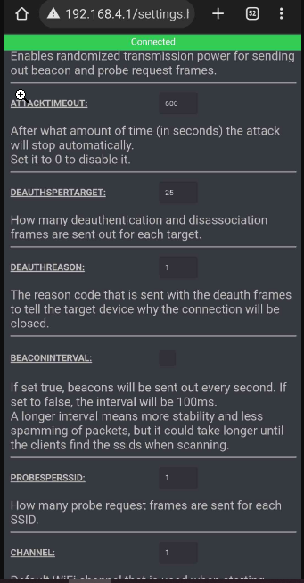
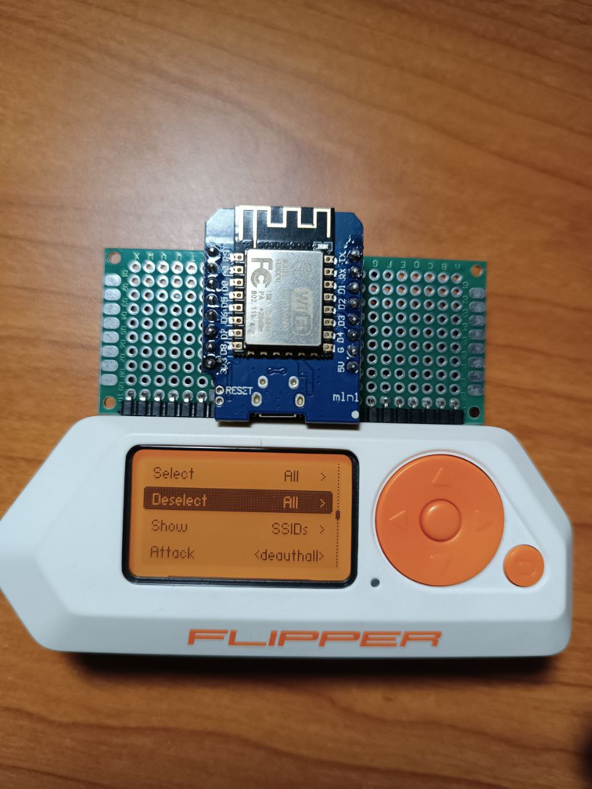

# FlipperZero PWNDTOOLS / Wifi Board / DEAUTH V2 - ESP8266 for Flipper Zero (Deauth working + attack power upgrading)

- Many users in the Flipper Zero community have found that using the <a href="https://github.com/SequoiaSan/FlipperZero-Wifi-ESP8266-Deauther-Module">SequoiaSan</a> V1 Deauther tool, the Deauth does not work and other options are not efficent.
- Here you can find the optimized Version 2.6.0 of the <a href="https://github.com/SequoiaSan/FlipperZero-Wifi-ESP8266-Deauther-Module">original Deauther</a> tool already compiled (.faps) and working for the Flipper Zero plus How-To and more.
- IMPORTANT : - UPDATED TO LATEST API 7.x , DOWNLOAD THE LATEST RELEASE FROM [HERE](https://github.com/HEX0DAYS/FlipperZero-PWNDTOOLS/blob/main/Deauther_v2_optimized/ESP8266_Wifi_Deauther_v2.fap) (So just flash old .bin and replace the old .faps with this new one and everything will work on new firmware update too. remod by Timotools.

# How-TO Flash the Deauther V2.6.0 .bin for the Esp8266 board

- Download the official .bin of the Deauther V2.6.0 tool from <a href="https://github.com/HEX0DAYS/FlipperZero-CONVERT/blob/96a9ca4bcb4e93c22d117a1ad27422149cdea6fb/Deauther2.6.0_FZ/esp8266_deauther_2.6.0.bin">HERE</a> , you can use the <a href="https://github.com/SpacehuhnTech/esp8266_deauther/wiki/Installation/70c7169963788c6a00cba1aa5d1939aedd463567#compiling-using-arduino-ide">ArduinoIDE</a> ,<a href="https://github.com/SpacehuhnTech/esp8266_deauther/wiki/Installation/70c7169963788c6a00cba1aa5d1939aedd463567#esptool-gui">Esptool-gui</a> ,Esptool or <a href="https://github.com/SpacehuhnTech/esp8266_deauther/wiki/Installation/70c7169963788c6a00cba1aa5d1939aedd463567)">many others</a> ,below I will show you how to do it with Esptool which is very easy and fast. 

# How-TO Flash the Deauther V2.6.0 .bin for the Esp8266 board using ESPTOOL

After download the V2 Deauther .bin we need to flash it on the Esp8266 via a single command. Just plug the USB Cable from Esp8266 to Computer and then launch this command from Esptool.

- Using the NodeMCU (or any similar development board), the flash location is 0x0000 and the mode is dout.

<b>esptool.py -p /dev/ttyUSB0 write_flash -fm dout 0x0000 esp8266_deauther_2.6.0.bin</b> or 

<b>esptool -p /dev/ttyUSB0 write_flash -fm dout 0x0000 esp8266_deauther_2.6.0.bin</b>

Where /dev/ttyUSB0 is the COM port of your device, write_flash is telling the program to write to flash memory, -fm dout is the flash mode and esp8266_deauther_2.6.0.bin is the name of your .bin file. if you get an error with this command, just enter your serial port replaced to /dev/ttyUSB0 , you can use <a href="https://www.uwe-sieber.de/usbtreeview_e.html#download">UsbTreeView</a> for see all the serial ports are connected via USB, after you have your COM port, just replace /dev/ttyUSB0 with your COM port, Ex COM1, COM2, COM3, COM4, COM5. And then Launch the command and wait for the flashing end

# We  need now to transfer the .faps on the flipper and everything will work

- You can download the updated to api 6.1 Deauther V2.6.0+ .faps from <a href="https://github.com/HEX0DAYS/FlipperZero-PWNDTOOLS/releases/download/2.6.0%2B/ESP8266_B_Wifi_Deauther.fap">HERE</a> (Already compiled) and put on applications/GPIO/ on the SD-Card of your Flipper Zero. Then plug the SD-card on your flipper, the esp8266 board on the flipper, go on Applications/GPIO and then you can run the version 2.6.0 the Deauther with everything working, <b>IMPORTANT</b> When you open the app, let the Esp8266 finish to scan, wait for the blue LED to go off, once it is off you can click on the other things, otherwise, the app will crash. every time the deauther is started it will start an automatic scan, remember not to touch anything while it does its startup scan.

# How to upgrade your Deauther's attacks

- Very simple, we should go and change the settings that we find when we connect via the web to our esp8266.
First, connect your device to your esp8266 via WiFi, the default password is : <b>deauther</b> once you are connected to your esp8266 via wifi, go to the browser and navigate to <b>192.168.4.1</b> once inside, you will be correctly in the gui of your Deauther, we need two settings.

- Change Deauthpertarget from 25 to 100 and Deauthreason from 1 to 4 and then click Save.

# Screenshoots of current Deauther at work, it seem like the Marauder tool.

# Need help? join the Uncensored & Unofficial Flipper Zero Discord Server! Join  <a href="https://discord.gg/MXCfNgwtW7">NOW!</a>

Thanks to @SpacehuhnTech , @JustDr00py and more!

-B4CKD00OR
